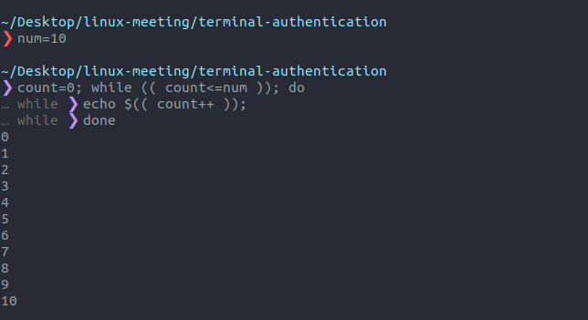

# bash scripting + some techniques

You can consider this repository as a bash cheatsheet, I am focusing on the main point and structure of the bash script. There are also some urls and resources to dive into.  

## shebang

A quotation from an amazing [article](https://medium.com/@codingmaths/bin-bash-what-exactly-is-this-95fc8db817bf) by Sanjay Mishra:
> This first line (#!/bin/bash or #!/bin/sh) has a name. It is known as ‘she-bang‘(shabang). This derives from the concatenation of the tokens sharp (#) and bang (!). It is also called as sh-bang, hashbang, poundbang or hash-pling.

Here is another [article](https://ryanstutorials.net/bash-scripting-tutorial/bash-script.php) of articles series by [Rayan](https://ryanstutorials.net/).

--------------

Let's recap:

It looks like a comment line at the file top most. There must not be spaces between `#`, `!` or the interpreter path, according to Rayan. Also, when you are lazy and you don't put it in your script, the default is set to the current environment of the terminal. 
As said in the pre-mentioned [article](https://ryanstutorials.net/bash-scripting-tutorial/bash-script.php) of articles series by [Rayan](https://ryanstutorials.net/)
> If you are at a terminal and running the Bash shell and you execute a script without a shebang then Bash will assume it is a Bash script.

Example:
```bash
#!/bin/bash
echo "As-salamu alaykum"
```

This is weird when you know that the shebang line can be included in python and javascript files as an example:
```bash
#!/usr/bin/env node
console.log('As-salamu alaykum from javascript!');
```

## Variables

`declare` expression: [click here](https://www.computerhope.com/unix/bash/declare.htm)


### Spacial variables

 - $? : the exit code of the last performed command 
 - \$$ : represents process id (pid)
 - $@ : all arguments
 - $# : arguments count 
 - $0 : the program running this script 
 - $1 : the first argument, or null
 - $LINENO : the line number where the \$LINENO is used
 - $RANDOM : random integer in [0, 32767] (signed "+" 16-bit integer).
 - $RANDOM : random integer in [0, 32767] (signed "+" 16-bit integer).

## Operators

Resources: [basic-operators-in-shell-scripting](https://www.geeksforgeeks.org/basic-operators-in-shell-scripting/)

### Arithmetic operations

You can find most of these operators by this command: `info expr`.

- add: `$num1 + $num2` or `$num1 += $num2`
- subtract: `$num1 - $num2` or or `$num1 -= $num2`
- multiplication: `$num1 * $num2` or or `$num1 *= $num2`
- division: `$num1 / $num2` or or `$num1 /= $num2`
- power: `$num1 ** $num2` or or `$num1 **= $num2`
- Modulus: `$num1 % $num2` or or `$num1 %= $num2`
- Uniary operator, increase: `$num1++` or or `++$num1`
- Uniary operator, decrease: `$num1--` or or `--$num1`

  Using `let` to do computations: [click here](https://www.computerhope.com/unix/bash/let.htm)


### logic operators

You can find these operators by this command: `info test`.

- `!($true)`
- `STRING = STRING`
- `STRING != STRING`
- `INTEGER1 -eq INTEGER2`
- `INTEGER1 -gt INTEGER2`
- `INTEGER1 -lt INTEGER2`
- `INTEGER1 = INTEGER2`
- `INTEGER1 \> INTEGER2`
- `INTEGER1 \< INTEGER2`

## Standard input and output


## For loop, if statements, case, while

### if statement

Tests used in logic expressions:
```
Operator			Description
! EXPRESSION			The EXPRESSION is false.
-n STRING			The length of STRING is greater than zero.
-z STRING			The lengh of STRING is zero (ie it is empty).
STRING1 = STRING2		STRING1 is equal to STRING2
STRING1 != STRING2		STRING1 is not equal to STRING2
INTEGER1 -eq INTEGER2		INTEGER1 is numerically equal to INTEGER2
INTEGER1 -gt INTEGER2		INTEGER1 is numerically greater than INTEGER2
INTEGER1 -lt INTEGER2		INTEGER1 is numerically less than INTEGER2
-d FILE				FILE exists and is a directory.
-e FILE				FILE exists.
-r FILE				FILE exists and the read permission is granted.
-s FILE				FILE exists and it's size is greater than zero (ie. it is not empty).
-w FILE				FILE exists and the write permission is granted.
-x FILE				FILE exists and the execute permission is granted.
```

for more about these tests used in logic expression type `info test` or `man test`.

----------
You can type conditions as:
- logic experssions
  ```bash
  if [ condition ]; then ...; fi
  if [ 1 = 2 ]; then ...; fi
  if [ 1 == 2 ]; then ...; fi # invalid syntax
  if [1 = 2 ]; then ...; fi   # invalid syntax
  if [ 1=2 ]; then ...; fi    # invalid syntax
  if [ condition1 ] && { [ condition2 ] || [ condition3 ]; }; then ...; fi
  if [[ 1 -gt 2 ]]; then ...; fi
  if [[ 1 > 2 && (... || ... && ...) ]]; then ...; fi
  if [[ "$foo" = a* ]]; then ...; fi # checks patterns
  ```
- math expressions
  ```bash
  if (( math expressions ))
    then echo "do command"
  elif [ consdition ]; then 
    echo "do command"
  fi
  ```
 - command
   Actually, we can consider logic expressions `[ ... ]` and math epxressions as commands, when the command exits with 0 "succeeded", the condition is satisfied, if it exits with any thing else "failed", if will proceed to `else` and `elif` if founded.
   ```bash
   > if (( 0 )); then echo true; else echo false; fi         # false
   > if [ 0 ]; then echo true; else echo false; fi           # true
   > if [ ]; then echo true; else echo false; fi             # false
   > test 0 -leq 1; echo $?                                  # 0
   > if test 0 -leq 1; then echo true; else echo false; fi   # true
   ```
   
   > Exit status of `test`: **0** if the expression is true, **1** if the expression is false, **2** if an error occurred.


### for loop

- For loop statement does throw an array or list of values, the same perception as for loop in python:
  ```bash
  for var_name in {start..end}; do
    
  done
  ### or ############333
  for var_name in {start..end..increment}; do
    
  done
  ```

- For loop can do such as in javascript, java, and C#, etc:
  ```bash
  for (( i=1; i<=10; i++ )); do
    echo $i
  done
  ```

  An alternative to te previous code:
  ```bash
  for $i in `seq 10`; do
    echo $i
  done
  ```

  You can use `break` statement to break if a specific condition statisfied, or `continue` to skip the following commands in the loop:
  ```bash
    for (( i=0; i<=10; i++ )); do
      if [ $i -eq 5 ]; then
        continue
      elif (( i == 7 )); then
        break
      fi
      echo $i
    done
  ```

### while, until

You can you a logical or math expression:
```bash
while (condition is true); do
  # commands ...
done
```

The same structure for `until`:
```bash
until (condition becomes true); do
  # commands ...
done
```

Example:



### case

This is an alternative to `if elif elif else fi`
```bash
case $1 in
  first_choice)
    # command
    ;;
  second_choice)
    # command
    ;;
  *)
    # Default logic
    echo $"Usage: $0 {start|stop}"
    exit 1
    ;;
esac
```

### select

To make the script user choose from a menu.
```bash
select user_choice in first_choice 2nd_choice 3rd_choice; do
  echo $user_choice
done
```


## Useful commands

You should take a look at these commands, you nearly will use them frequently.

> cal, date, awk, grep, sed, tee, tr, printf, expr, test, sensors, free, ps, pgrep, pkill, curl, wget, xclip, youtube-dl

- cal, data
   ```bash
   ~/Desktop/linux-meeting/terminal-authentication
   ❯ cal
      September 2020     
   Su Mo Tu We Th Fr Sa  
         1  2  3  4  5  
   6  7  8  9 10 11 12  
   13 14 15 16 17 18 19  
   20 21 22 23 24 25 26  
   27 28 29 30           

   ~/Desktop/linux-meeting/terminal-authentication
   ❯ date "+%Y %b %d (%a) - %I:%M%p"
   2020 Sep 27 (Sun) - 12:02AM
   ```

- awk
  See this [video](https://www.youtube.com/watch?v=jJ02kEETw70)

- memory details:
  ```bash
  mem (){ free | awk '/^Mem/ { print $3/$2"%"}' }
  memusage() {
    ps axch -o cmd,%mem --sort=-%mem |
    head -n $([ ! -z $1 ] && echo "$1" || echo 10)
  }
  ```

- link
  To create a symbolic link:

  ```bash
  ❯ sudo ln -s  file_to_be_linked  the_symbolic_link_file
  
  #### for example ###########3
  ❯ sudo ln -fs /home/ms/.nvm/versions/node/v12.18.3/bin/node /usr/local/bin/node

  ❯ file /usr/local/bin/node
  /usr/local/bin/node: symbolic link to /home/ms/.nvm/versions/node/v12.18.3/bin/node
  ```

  Note that the path to the linked file has to be in the PATH variable


# Authentication from terminal

In the subdirectory `terminal-authentication`. You can find simple signup and login scripts, the signed-up users are saved locally, but you can you the command `curl` to communicate with a remote or local server and save your data in a secure place.

# License

MIT
